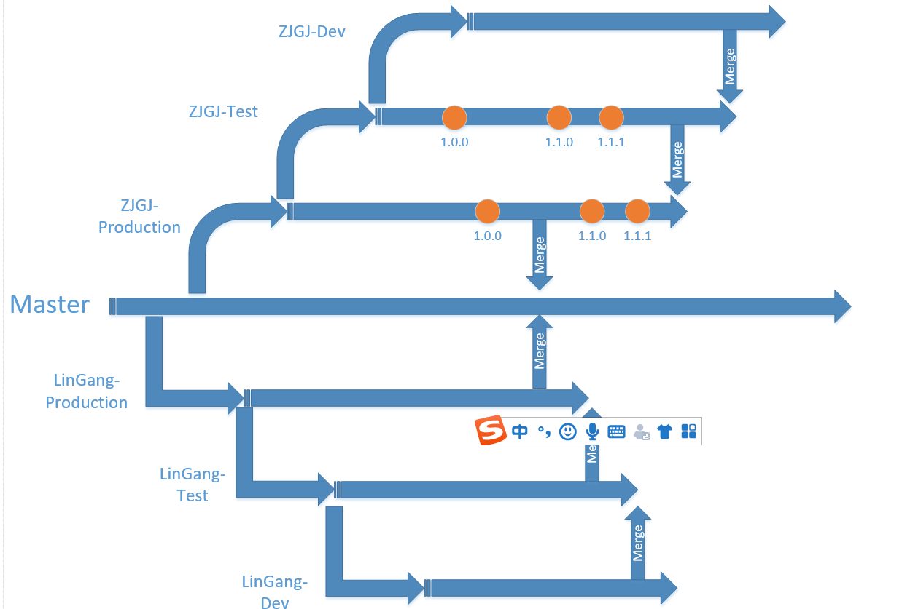

αBIM平台项目GIT仓库文档
=====
# 目录

- 仓库分支结构
- 仓库分支权限
- 分支版本号约定

## 1.仓库分支结构

### 仓库分支结构关系

### 分支详细说明

>分支`master`

平台基础全分支，具有所有好的稳定功能（同名不冲突的功能）

>分支`production`

基于master的分支，但是剔除了一些功能，给特定客户的定制的项目功能，用于给客户定期发布的分支，每次部署增加`tag`（版本标签），再生产环境发现的紧急的需要马上处理的bug修复提交到生产环境分支作为`hotfix`（不建议直接提交）

- `ZJGJ-production`
- `LinGang-production`

>分支`test`

基于`project`的分支，用于内部部署测试环境的分支。该分支的功能定期部署到内部测试服务器。一定阶段稳定后，`merge`到`production`分支。生产环境发现的紧急的一个或多个bug需要修复可以直接在该分支提交，在本地测试环境中测试修复通过后`merge`到生产环境分支。

- `ZJGJ-test`
- `LinGang-test`

>分支`dev`

项目内部开发人员开发版本，用于项目相关开发人员开发新功能、修改旧功能的开发分支。一定阶段后，`merge`到`test`分支，用于内部服务器部署测试

- `ZJGJ-dev`
- `LinGang-dev`

## 2.仓库分支操作权限

分支 | 责任人 | 责任描述
--- | --- | ---
master | 古利旭 | 负责监控`master`的产品功能，为新项目或者产品开辟分支。该分支的某些可定制功能，需要能适应不同需求的配置要求，如首页整体布局不变的情况下，能包含多个项目可配置文件，并自带一套默认的产品级的配置
production | 负责客户生产环境服务器部署的人员 | 定期将该分支的功能部署到客户的生产环境，并通知客户使用
test | 负责内部测试环境服务器部署的人员 | 定期将该分支的功能部署到内部的测试环境，并通知测试人员按照功能模块和测试用例严格测试
dev | 参与该项目的所有开发人员 | 在该分支上针对客户需求进行功能迭代开发

## 3.分支版本号约定

>版本号命名约定

`项目名称`.`主版本号`.`子版本号`.`修正版本号`.`版本阶段号`

>版本号说明

- 项目名称：标记当前是哪个项目的`tag`

- 主版本号：当功能模块有较大的变动，比如增加多个模块或者整体架构发生变化。此版本号由项目决定是否修改。

- 子版本号：当功能有一定的增加或变化，比如增加了对权限控制、增加自定义视图等功能。此版本号由项目决定是否修改。

- 阶段版本号：一般是 Bug 修复或是一些小的变动，要经常发布修订版，时间间隔不限，修复一个严重的bug即可发布一个修订版。此版本号由项目经理决定是否修改。

- 版本阶段号：此版本号用于标注当前版本的软件处于哪个开发阶段，当软件进入到另一个阶段时需要修改此版本号。此版本号由项目决定是否修改。

>版本阶段号定改约定

- alpha版: 此版本表示该软件在此阶段主要是以实现软件功能为主，通常只在软件开发者内部交流，一般而言，该版本软件的Bug较多，需要继续修改。

- beta版: 该版本相对于α版已有了很大的改进，消除了严重的错误，但还是存在着一些缺陷，需要经过多次测试来进一步消除，此版本主要的修改对像是软件的UI。

- rc版: 该版本已经相当成熟了，基本上不存在导致错误的BUG，与即将发行的正式版相差无几。

- release版: 该版本意味“最终版本”，在前面版本的一系列测试版之后，终归会有一个正式版本，是最终交付用户使用的一个版本。该版本有时也称为标准版。一般情况下，release不会以单词形式出现在软件封面上，取而代之的是符号`r`。

>示例说明

`ZJGJ.0.1.0.alpha`
**代表`中建国际`项目初版，内部部署在测试服务器上的测试版本**

